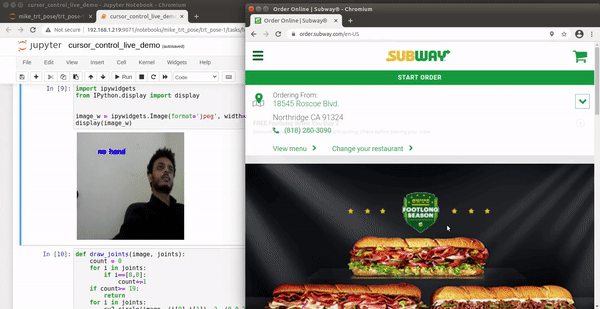

# Hand Pose Estimation And Classification

This project is an extention of TRT Pose for Hand Pose Detection. The project includes 

- Pretrained models for hand pose estimation capable of running in real time on Jetson Xavier NX.

- Scripts for applications of Hand Pose Estimation

  -  Hand gesture recoginition (hand pose classification) 
  
  -  Cursor control 
  
  -  Mini-Paint type of application 
  
- Pretrained model for gesture recoginition 

## Getting Started 

### Step 1 - Install trt_pose and it's dependencies 

Make sure to follow all the instructions from trt_pose and install all it's depenedencies. 
Follow step 1 and step 2 from https://github.com/NVIDIA-AI-IOT/trt_pose. 

### Step 2 - Install dependecies for hand pose 
      
    pip install traitlets
     
### Step 3 - Download model wieght

| Model | Weight |
|-------|---------|
| hand_pose_resnet18_baseline_att_224x224_A | [download model](https://drive.google.com/file/d/1NCVo0FiooWccDzY7hCc5MAKaoUpts3mo/view?usp=sharing) |

1. Download the model weight using the link above.  

2. Place the downloaded weight in the [model](model/) directory

### Step 4 - Run hand pose and it's applications 

A) Hand Pose demo 
      
   - Open and follow live_hand_pose.ipynb notebook. 
   
   

B) Hand gesture recoginition (hand pose classification) 
    
   - Install dependecies
      - scikit-learn 
         - pip install -U scikit-learn 
         - or install it from the source 
         
   The current gesture classification model supports six classes (fist, pan, stop, fine, peace, no hand). 
   More gestures can be added by a simple process of creating your own dataset and training it on an svm model. 
   An SVM model weight is provided for inference.
   
   
        
   To make your own hand gesture classification from the hand pose estimation, follow the following steps 
        
   - Create your own dataset using the gesture_data_collection.ipynb or gesture_data_collection_with_pose.ipynb. 
     This will allow you to create the type of gestures you want to classify. (eg. tumbs up, fist,etc). 
     This notebook will automatically create a dataset with images and labels that is ready to be trained for gesture classification.
        
   - Train using the train_gesture_classification.ipynb notebook file. It uses an SVM from scikit-learn. 
     Other types of models can also be experimented. 
        
 C) Cursor control application
 
    - Install dependecies 
       - pyautogui 
          - python3 -m pip install pyautogui
          - On jetson install it from the source 
          
    - Open and follow the cursor_control_live_demo.ipynb notebook. 
    - This will allow you to control your mouse cursor on your desktop. It uses the hand gesture classification. 
      When your hand geture is pan, you can control the cursor. when it is click, it's left click. 
   | Buying a tuna sandwich :) | navigating map |
   |-------|---------| 
   | | |
    
D) Mini-Paint

  A mini paint app that let's you draw, erase and clear on your camera screen. 
  
-------------------------------------------------------------------------------------------------------------------------------------
The model was trained using the training script in trt_pose and the hand pose data collected in Nvidia.

Model details: resnet18

-------------------------------------------------------------------------------------------------------------------------------------

## See also

- [trt_pose](https://github.com/NVIDIA-AI-IOT/trt_pose) - Real-time pose estimation accelerated with NVIDIA TensorRT
- [deepstream_pose_estimation](https://github.com/NVIDIA-AI-IOT/deepstream_pose_estimation) - [trt_pose](https://github.com/NVIDIA-AI-IOT/trt_pose) deepstream integration
- [ros2_trt_pose](https://github.com/NVIDIA-AI-IOT/ros2_trt_pose) - ROS 2 package for "trt_pose": real-time human pose estimation on NVIDIA Jetson Platform
- [torch2trt](http://github.com/NVIDIA-AI-IOT/torch2trt) - An easy to use PyTorch to TensorRT converter

## References

Cao, Zhe, et al. "Realtime multi-person 2d pose estimation using part affinity fields." Proceedings of the IEEE Conference on Computer Vision and Pattern Recognition. 2017.

Xiao, Bin, Haiping Wu, and Yichen Wei. "Simple baselines for human pose estimation and tracking." Proceedings of the European Conference on Computer Vision (ECCV). 2018.
